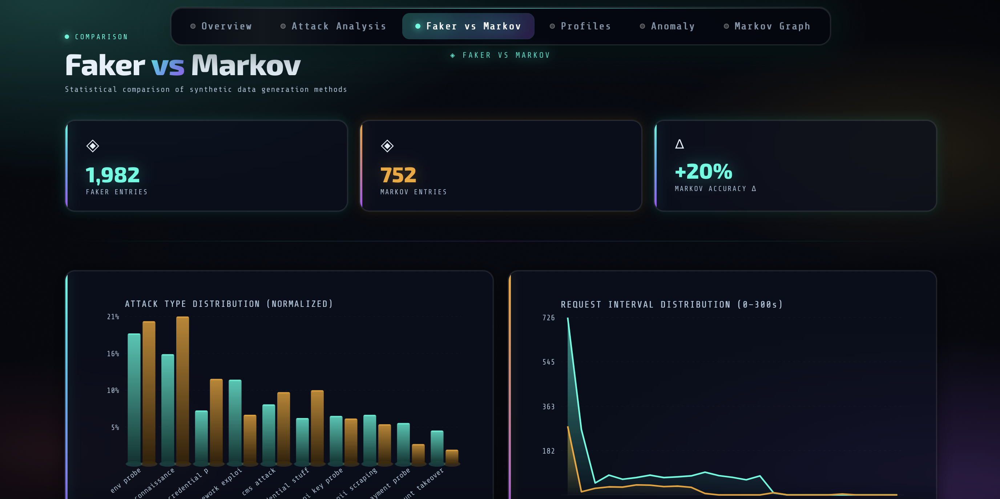

# 🕸️ Phantom Trace: Honeypot Intelligence with Faker, Markov, and LLM + MBTI Profiling

> Synthetic attack log generation, LLM-powered classification, and MBTI-style attacker profiling — built as an AI systems engineering portfolio project.


**🤖 Live Demo → [Phantom Trace 👻](https://phantom-trace.vercel.app)**

---

<p align="center">
  
  
  
</p>

---

## What This Is

Most honeypot projects stop at log collection. This one starts there — but the real question is:

**Can an LLM meaningfully classify attacker behavior, and does the data generation method (random vs. sequential) affect that classification?**

To answer that without running a real honeypot (and the legal/security surface that comes with it), this project generates two flavors of synthetic attack logs and puts them through an LLM analysis pipeline.

This was not the original plan. A dummy fitness company site (bodysyniq.fit) was deployed specifically as a honeypot — complete with canary tokens and intentionally exposed `.env` — but Cloudflare's bot protection, while excellent for production use, blocked the very traffic this project needed to observe. Rather than expose a VPS or pay for higher-tier plans, the project pivoted to synthetic data: a cleaner approach that also enables ground-truth labeling and reproducibility.

---

## Architecture

```
┌─────────────────────────────────────────────────────────┐
│                    DATA GENERATION                      │
│                                                         │
│   personas.py                                           │
│   ├── Site A: API-first developer site                  │
│   └── Site B: Dummy company (PII / financial exposed)   │
│                                                         │
│   faker_generator.py   →  random sampling               │
│   markov_generator.py  →  state transition chains       │
│                                                         │
│   Output: honeypot_logs_faker.json                      │
│           honeypot_logs_markov.json                     │
└────────────────────┬────────────────────────────────────┘
                     │
┌────────────────────▼────────────────────────────────────┐
│                  LLM PIPELINE                           │
│                                                         │
│   llm_pipeline.py                                       │
│   ├── Session feature extraction                        │
│   ├── Attack classification  (Structured Outputs)       │
│   ├── Threat scoring         (1–10)                     │
│   ├── Intent summarization   (natural language)         │
│   └── MBTI attacker profiling                           │
│                                                         │
│   Output: classified_logs_faker.json                    │
│           classified_logs_markov.json                   │
│           classification_report.json                    │
└────────────────────┬────────────────────────────────────┘
                     │
┌────────────────────▼────────────────────────────────────┐
│                 VISUALIZATION                           │
│                                                         │
│   dashboard.py  (Streamlit)                             │
│   ├── Overview          — volume, origins, timeline     │
│   ├── Attack Analysis   — types, status codes, treemap  │
│   ├── Faker vs Markov   — distribution + accuracy delta │
│   ├── Attacker Profiles — MBTI cards + radar chart      │
│   ├── Anomaly Detection — Isolation Forest results      │
│   └── Markov Graph      — NetworkX state transitions    │
└─────────────────────────────────────────────────────────┘
```

---

## Why Synthetic Data?

Running a real honeypot introduces:
- Legal gray areas (CFAA, GDPR)
- VPS security surface
- Unpredictable data quality and coverage

Synthetic data sidesteps all of that while enabling something a real honeypot cannot: **intentional design of attack scenarios** with ground truth labels. This makes the LLM classification meaningful — we can actually measure accuracy.

This is standard practice in security research (MITRE ATT&CK, Splunk BOSSEC).

---

## Real-World Calibration

The synthetic data is not purely fictional. Attack paths, IP regions, and Markov transition probabilities were partially calibrated against observations from **two live sites** operated over 1–3 months (March 2026):

- Site A: a developer portal hosting multiple API-key-gated applications
- Site B: a dummy company site with intentionally exposed `.env` and canary tokens

**Disclaimer:** small sample, two sites only, short observation window. Not statistically significant. Used as design guidance, not ground truth. See [`/docs/real-observations/`](docs/real-observations/) for raw screenshots.

### What the real data showed

**Attack origins diverge sharply from common assumptions.**
Textbook threat intel points to CN/IN/RU as dominant sources. In practice, the overwhelming majority of traffic originated from **European cloud infrastructure** — Hetzner (Frankfurt), DigitalOcean (Amsterdam), OVHcloud (Paris), AWS eu-north-1 (Stockholm). These are datacenter exit IPs, not attacker nationality. The likely explanation: cheap EU VPS abuse and VPN/proxy exit nodes.

| Expected (common assumption) | Observed (real data) |
|------------------------------|----------------------|
| China, India, Russia dominant | Near zero            |
| US moderate                  | Moderate (LAX, ORD)  |
| Europe minor                 | Dominant (FRA, AMS, ARN, OSL, CDG) |

**Developer sites attract disproportionate traffic.**
The developer portal hosting API-key-gated applications received roughly 10x more daily attack traffic than the dummy company site with canary tokens and exposed `.env` (poor Chad). Modern attackers appear to prioritize credential theft — specifically API keys that enable immediate, programmatic access — over static data exfiltration.

**AWS credential paths are specifically and systematically targeted.**
Scanners didn't just probe `/.env` — they ran through a structured dictionary: `/awsconfig.js`, `/aws.env`, `/.aws/credentials`, `/aws-exports.js`, `/crm/.env`, `/.env.bak`, `/.env.live`, `/.env.prod`. This reflects purpose-built tooling, not generic scanners.

**Multilingual scanner dictionaries.**
WordPress paths arrived with language prefixes: `/cms/wp-includes/wlwmanifest.xml`, `/site/wp-includes/...`, `/sito/wp-includes/...` (`sito` = Italian for "site"). Suggests scanner dictionaries built from multilingual web corpora.

**New domains spike immediately.**
Within hours of DNS propagation, scanning began. Volume peaked in the first week then stabilized — consistent with Shodan/Censys indexing behavior.

**Timing aligns with European business hours.**
Attack volume peaked between 00:00–08:00 CDT, which corresponds to 06:00–16:00 UTC — European working hours. Further evidence that the infrastructure (if not the operators) is EU-based.

---

## Faker vs Markov — Why Both?

| | Faker | Markov |
|---|---|---|
| **What it models** | Distribution of attack types | Sequential attacker behavior |
| **Session context** | None — each request independent | Full — transitions follow probability chains |
| **Realism** | Statistical realism | Behavioral realism |
| **LLM classification** | Harder — no sequential signal | Easier — intent emerges from sequence |

The hypothesis: **Markov logs will be classified more accurately** because sequential context makes attacker intent legible to the LLM. The dashboard shows whether this holds.

---

## MBTI Attacker Profiling

The LLM maps each attacker session onto a modified MBTI framework:

| Axis | Security Interpretation |
|------|------------------------|
| **E / I** | Broad scanner vs. targeted, focused attack |
| **S / N** | Known CVEs and tools vs. exploratory, unknown endpoints |
| **T / F** | Automated and systematic vs. manual and adaptive |
| **J / P** | Planned phase progression vs. opportunistic and chaotic |

Each session gets a type (e.g. `INTJ`), an archetype label (e.g. *"The Architect"*), a behavioral description, and a threat score.

This is not serious threat intelligence. It is a deliberate design choice to make the analysis **memorable and explainable** — which matters for a portfolio.

---

## Tech Stack

| Layer | Tools |
|-------|-------|
| Data generation | `faker`, `random`, custom Markov engine |
| LLM pipeline | `anthropic` SDK, Structured Outputs, async Batch API |
| Anomaly detection | `scikit-learn` Isolation Forest (session + request level) |
| Analysis | `pandas`, `networkx` |
| Frontend | Next.js, TypeScript, Tailwind CSS |

---

## Setup

```bash
git clone https://github.com/YOUR_USERNAME/phantom-trace
cd phantom-trace
```

**Generate logs (Python):**
```bash
pip install -r requirements.txt
python main.py
python llm_pipeline.py   # requires ANTHROPIC_API_KEY
python anomaly_detection.py
```

**Launch dashboard (Next.js):**
```bash
npm install
npm run dev
```

---

## Project Structure

```
phantom-trace/
├── src/
│   ├── app/
│   │   ├── globals.css
│   │   ├── layout.tsx
│   │   └── page.tsx
│   ├── components/
│   │   ├── ui/
│   │   ├── AnomalyDetection.tsx
│   │   ├── AttackAnalysis.tsx
│   │   ├── AttackerProfiles.tsx
│   │   ├── FakerVSMarkov.tsx
│   │   ├── Footer.tsx
│   │   ├── MarkovGraph.tsx
│   │   ├── Navigation.tsx
│   │   └── Overview.tsx
│   └── lib/
│       └── types.ts
├── public/
│   └── data/                # JSON outputs (classification + anomaly results)
├── personas.py              # Site definitions + Markov transition matrices (real-data calibrated)
├── faker_generator.py       # Random sampling log generator
├── markov_generator.py      # Markov chain log generator
├── main.py                  # Run both generators
├── llm_pipeline.py          # LLM classification + MBTI profiling
├── anomaly_detection.py     # Isolation Forest (session-level + request-level)
├── requirements.txt
├── package.json
├── tailwind.config.js
├── tsconfig.json
├── README.md
└── docs/
    └── real-observations/   # Screenshots from live sites (1-3 months)
```

---

## Key Findings

- **LLM classification accuracy**: Faker `20%` · Markov `40%`
  Markov logs are classified twice as accurately — sequential context
  makes attacker intent legible to the LLM. The low absolute numbers
  reflect the challenge of classifying granular attack sub-types from
  HTTP logs alone, not a failure of the pipeline.
- **Faker sessions show tighter anomaly clustering** — random distribution
  creates a cleaner baseline for Isolation Forest; Markov's sequential
  context makes individual sessions more predictable, so true outliers
  stand out differently
- **Request-level anomalies concentrate around state transitions** —
  `/wp-admin/` and `/oauth/authorize` 302 redirects were the most
  anomalous requests in Markov logs, suggesting phase shifts are the
  most detectable moments in an attack chain
- **ISTJ dominates** (25/40 sessions) — the majority of simulated
  attackers profile as methodical, systematic, and tool-driven rather
  than creative or adaptive
- **Top archetypes**: The Credential Harvester · The Methodical Cartographer · The Corporate Auditor

---

## What I Learned

This project sits at the intersection of:

- **Data engineering** — designing synthetic datasets with intentional statistical and behavioral properties
- **Statistical modeling** — Markov chains as a behavioral model, Isolation Forest for anomaly detection
- **LLM engineering** — Structured Outputs for reliable JSON extraction, prompt design for security classification
- **Visualization** — communicating technical findings to a non-technical audience

The most interesting result was not the accuracy numbers — it was observing *where* the LLM misclassified, and what that reveals about how sequential context affects language model inference.

---

## Note on Ethics

All data in this project is fully synthetic. No real user data, IP addresses, or attack traffic was collected or used. Attacker IP addresses are procedurally generated and do not correspond to real systems.

---

## License

MIT
